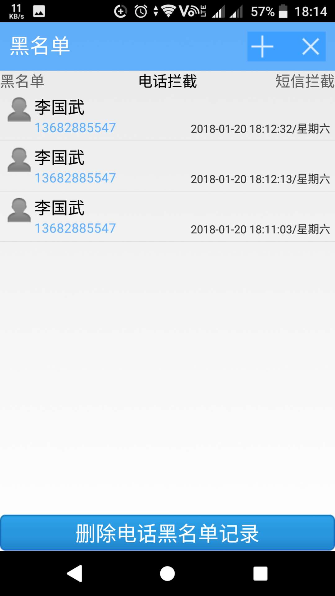

## WustBlackList

>大三时开发的安卓电话黑名单，电话拦截开源版。

## 说明
>原生java语言开发，无任何框架，应用了反射机制，目前只能在应用打开时拦截，未严格测试，可能有部分bug。

## 基本功能
* 添加黑名单
* 拦截电话
* 拦截短信
* 更改拦截黑名单方式
* 更改拦截来电方式
* 拦截短信关键字（未完成）
* 夜间免打扰（未完成）
* 会议免打扰（未完成）
* 黑名单服务化（未完成）

## 应用截图

